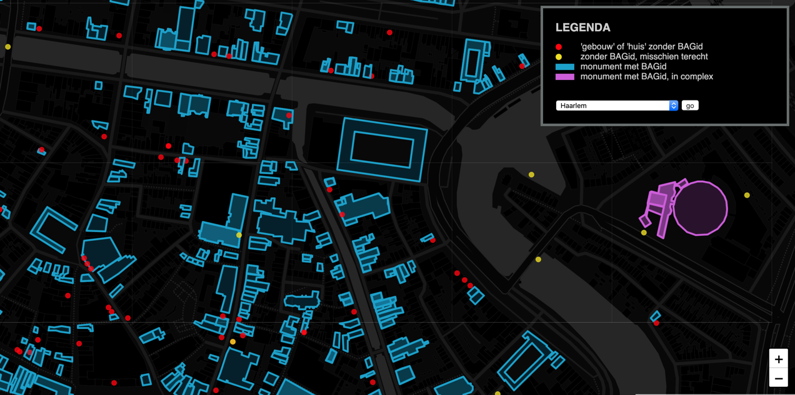

# Rijksmonumenten / BAG

Deze kaartapplicatie toont rijksmonumenten, per gemeente. De data wordt betrokken van Wikidata. Als bij een monument een [BAG-pand-id](https://www.wikidata.org/wiki/Property:P5208) is vermeld, wordt uit de BAG de bijbehorende polygoon opgehaald.

Doel van de applicatie is tonen welke monumenten op Wikidata al voorzien zijn van een BAG-pand-id (dit is op het moment van schrijven alleen in Noord-Holland op enige schaal het geval) en welke monumenten onderdeel zijn van een complex. 

De eerste keer dat een gemeente bekeken wordt, wordt op de achtergrond een SPARQL query gedraaid en van de resultaten een geojsonbestand gemaakt en opgeslagen. Een volgende keer dat die gemeente bekeken wordt, wordt het opgeslagen geojsonbestand gebruikt. Wil je een bestaand geojsonbestand vervangen dan kan je dat forceren door `&uncache=true` aan de url toe te voegen.
